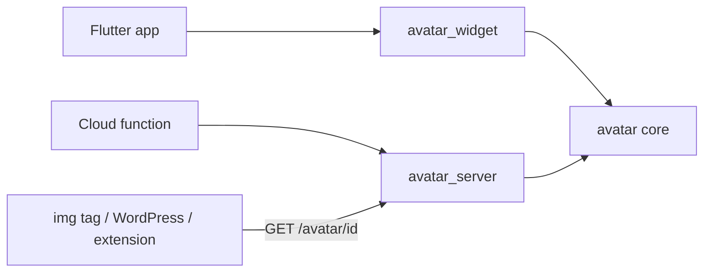
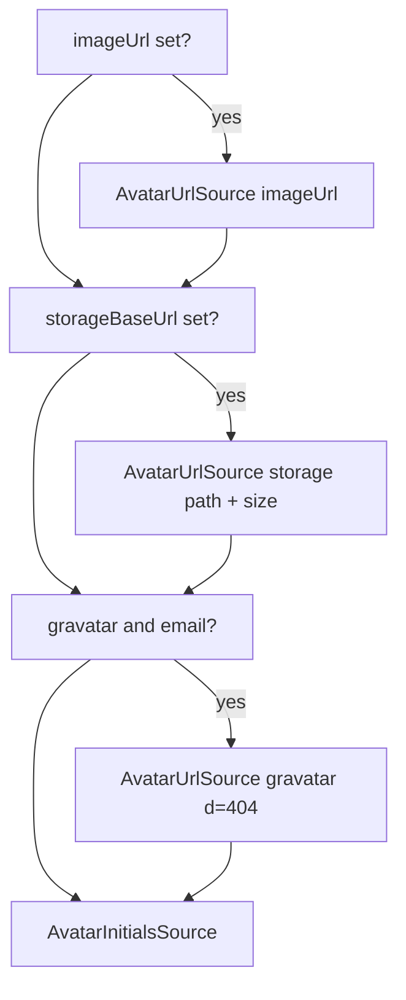

# Avatar support — specification

2026-09-18 · @Someone

## Goals and non-goals

Adding avatars to any app or function must be one identity object plus one call, with client and server always agreeing on what a given user looks like.

**Goals**

- Same identity → same avatar (image, or initials + color) on Flutter mobile, Flutter web (JS and Wasm), and Dart cloud functions.
- Graceful fallback chain: uploaded/provider image → generated initials. Never a broken image, never an empty box.
- Zero Flutter dependency in the core so functions stay small.
- Storage location of uploaded avatars derived from a single shared convention, never hard-coded per app.
- Consumers outside Dart (plain ``, WordPress, Chrome extension) can fetch an avatar by URL alone.

**Non-goals (v1)**

- Image cropping/editing UI.
- Animated avatars, video, 3D.
- Moderation of uploaded images.
- Per-app custom avatar art styles (identicons, blockies). Extension point is reserved, not implemented.

## Package layout

The feature lands as one `avatar` module inside each of the three existing packages plus a small Firebase Auth adapter package; the Dart core owns every rule the others rely on.

| Package | Module / library | Depends on | Contents |
| --- | --- | --- | --- |
| Dart (core) | `lib/avatar.dart` | `crypto` (md5 for Gravatar only), nothing platform-specific | Model, resolver, stable hash, initials, color, storage path convention, SVG renderer |
| Flutter | `lib/avatar_widget.dart` | core, `flutter`, optional `cached_network_image` | `AvatarWidget`, `AvatarTheme`, initials `CustomPainter`, image loading with fallback |
| Functions (Dart) | `lib/avatar_server.dart` | core, `image`, existing Firebase storage/HTTP abstraction | Upload + resize, HTTP endpoint serving stored image or generated SVG |
| Firebase Auth adapter (new, Dart) | `avatar_firebase_auth.dart` | core, existing Firebase Auth abstraction (client and admin) | `AvatarIdentity` from a Firebase user: works in Flutter and in functions |

Rules:

- The Flutter and Functions modules must not re-implement anything in the core (initials, color, path). They call it.
- The core has no `dart:io`, `dart:html`, or `dart:ui` imports so it compiles on VM, JS, and Wasm.
- Public API is exported from a single `avatar.dart` entry per package; internals live under `src/`.



Every consumer reaches the shared rules through the core; non-Dart clients go through the HTTP endpoint.

## Core model

Three types carry everything: what we know (`AvatarIdentity`), how to draw it (`AvatarSource`), and how the app wants it (`AvatarOptions`). All are immutable value types with `==`, `hashCode`, `toString`, `copyWith`, and `toMap`/`fromMap` for JSON.

### AvatarIdentity

| Field | Type | Required | Notes |
| --- | --- | --- | --- |
| `id` | `String` | yes | Stable key used for color and storage path. Typically the auth uid. Must be non-empty; trimmed. |
| `displayName` | `String?` | no | Free text. Used for initials before `email`. |
| `email` | `String?` | no | Used for initials when no name, and for Gravatar. Lower-cased and trimmed before use. |
| `imageUrl` | `String?` | no | Explicit photo (uploaded, or provider `photoURL`). Wins over everything when set. |
| `updatedAt` | `int?` | no | Epoch ms of last avatar change. Appended as a cache-busting query param to storage URLs. |

All fields are plain strings/ints so the identity can be built from a Firebase user, a Firestore doc, or a request body without adapters.

### AvatarSource (sealed)

| Subclass | Fields | Meaning |
| --- | --- | --- |
| `AvatarUrlSource` | `Uri uri` | Load this image. Any scheme the consumer supports (https, gs, data). |
| `AvatarInitialsSource` | `String initials`, `int backgroundArgb`, `int foregroundArgb` | Draw text on a colored disc. Always the last element of a resolution. |

Reserved for later, not in v1: `AvatarBytesSource`, `AvatarIdenticonSource`. Adding a subclass is a breaking change for `switch` consumers, so v1 ships with `default` branches documented as required.

### AvatarOptions

| Field | Type | Default | Notes |
| --- | --- | --- | --- |
| `storageBaseUrl` | `String?` | null | Public base for `avatarStoragePath`. Null disables the storage source. |
| `preferredSize` | `int` | 256 | Storage variant to request (see Storage). |
| `gravatar` | `bool` | false | Insert a Gravatar `?d=404` URL after storage, before initials. |
| `maxInitials` | `int` | 2 | 1 or 2. |
| `palette` | `List<int>` | built-in 16 colors | ARGB backgrounds; foreground picked for contrast. |

Options are passed per call or set once through `AvatarTheme` (Flutter) / server config (Functions).

## Resolution

`List<AvatarSource> resolveAvatar(AvatarIdentity identity, {AvatarOptions options})` returns an ordered, non-empty list; consumers try each in turn and stop at the first that loads.



Each box that applies appends one source; `AvatarInitialsSource` is always appended last, so the list is never empty.

Contract:

- Pure function: no I/O, no clock, no randomness. Same inputs → identical list on every platform.
- `imageUrl` is used verbatim (parsed with `Uri.parse`; an unparsable value is skipped, not thrown).
- The storage URL gets `?v=<updatedAt>` when `updatedAt` is non-null so a re-upload busts image caches.
- Gravatar URL: `https://www.gravatar.com/avatar/<md5(email)>?s=<preferredSize>&d=404`. `d=404` makes a missing Gravatar a load error so the fallback continues.
- Resolution does not check whether a URL exists. Existence is the consumer's problem (widget load error, server HEAD/GET).
- Complexity is O(1); it may be called on every widget build.

A helper `AvatarInitialsSource initialsFor(AvatarIdentity, {AvatarOptions})` exposes just the last step for callers that want the placeholder alone.

## Deterministic initials and color

Initials come from one function and color from one hash so a server-rendered SVG and a client-painted disc are pixel-equivalent in content.

### `String avatarInitials(AvatarIdentity, {int max = 2})`

1. Candidate text = `displayName` trimmed; if empty, the part of `email` before `@`; if still empty, `id`.
2. Split on whitespace, `.`, `_`, `-`, `+`. Drop empty parts.
3. Take the first grapheme of the first part; if `max == 2` and there are 2+ parts, add the first grapheme of the last part.
4. Upper-case using `toUpperCase()` (locale-independent).
5. Never return empty: if everything fails return `"?"`.

| Input | Output |
| --- | --- |
| `Alex Martin` | `AM` |
| `Alexandre` | `A` |
| `jean-paul.dupont@x.fr` (no name) | `JD` |
| `ÉLODIE` | `É` |
| `李小龍` | `李` |
| `""` and no email | `?` |

Grapheme = first Unicode extended grapheme cluster (use `characters` package, which is pure Dart), so emoji and combining marks are not cut in half.

### `int avatarHash(String id)`

FNV-1a 32-bit over the UTF-8 bytes of `id`. Chosen because it is trivial to reimplement in JS/PHP if a non-Dart client ever needs it, and unlike Dart `String.hashCode` it is identical on VM, dart2js, and Wasm. Constants: offset `0x811C9DC5`, prime `0x01000193`, masked to 32 bits after each multiply.

### Color

- `backgroundArgb = palette[avatarHash(id) % palette.length]`.
- `foregroundArgb` = white if the background's relative luminance (WCAG formula) is below 0.5, else near-black `0xFF1F1F1F`.
- The built-in palette is 16 mid-saturation colors that read well on both light and dark UIs; it is part of the public API and versioned: changing a palette entry changes users' colors, so it is a semver-minor with a changelog note.
- Hash on `id`, never on `displayName`: a name change must not recolor the user.

## Storage convention

Uploaded avatars live at a path computed by the core, so the function that writes and the app that reads never negotiate.

`String avatarStoragePath(String id, {int size = 256})` → `avatars/<id>/<size>.webp`

| Size | Use |
| --- | --- |
| 64 | List rows, chips |
| 256 | Profile headers, dialogs. Default. |
| 512 | Full-screen or retina profile pages |

- Sizes are a fixed set (`AvatarSizes.all = [64, 256, 512]`). Asking for another size throws `ArgumentError` so a typo cannot create an orphan variant.
- Format is always WebP, lossy quality 80, square, center-cropped. One format keeps the path predictable and the storage rules simple.
- `Uri avatarStorageUri(String baseUrl, String id, {int size, int? updatedAt})` = `<baseUrl>/<path>` + `?v=<updatedAt>` when given. `baseUrl` is whatever public prefix serves the bucket (Firebase Storage download base, a CDN, or the Functions endpoint). The core does not know which.
- `id` is used raw in the path; callers must ensure it is a safe segment (uid-like). The core validates with `^[A-Za-z0-9_-]{1,128}$` and throws otherwise.
- Storage security rules: public read on `avatars/**`, write only by the function (service account). Client uploads go through the function, never directly, so resizing and validation are guaranteed.

## SVG rendering

`String avatarInitialsSvg(AvatarInitialsSource source, {int size = 128, AvatarShape shape = circle})` produces a self-contained SVG string usable as an HTTP body or a `data:` URI.

- Output: `<svg xmlns viewBox="0 0 <size> <size>">` with a `<circle>` (or `<rect rx>` for `rounded`, plain `<rect>` for `square`) filled with `backgroundArgb` and one `<text>` element, `text-anchor="middle"`, `dominant-baseline="central"`, font-size `size * 0.42` for two characters and `size * 0.5` for one.
- Font stack: `-apple-system, BlinkMacSystemFont, 'Segoe UI', Roboto, Helvetica, Arial, sans-serif`. No embedded font, so the file is < 500 bytes.
- Initials are XML-escaped.
- Colors written as `#RRGGBB`; alpha is dropped (backgrounds are opaque by contract).
- Output is byte-stable for identical inputs (no timestamps, no random ids) so it can be cached forever by URL.
- `Uri avatarInitialsDataUri(...)` wraps the SVG as `data:image/svg+xml;utf8,<percent-encoded>` for clients that only take an image URL.

## Flutter package

One widget, one theme extension; apps never touch `AvatarSource` directly unless they want to.

### `AvatarWidget`

```dart
AvatarWidget(
  identity,            // AvatarIdentity, required
  size: 40,            // logical px, required
  shape: AvatarShape?, // circle | rounded | square; default from theme
  options: AvatarOptions?, // overrides theme
  onTap: VoidCallback?,
)
```

Behavior:

1. `resolveAvatar(identity, options: effectiveOptions)` on build (cheap, pure).
2. Walk the list: for each `AvatarUrlSource`, load with `Image.network` (or `CachedNetworkImage` when the app registers that loader through `AvatarTheme.imageProvider`). On `errorBuilder` advance to the next source. `data:` URIs are decoded locally, not fetched.
3. `AvatarInitialsSource` is drawn by `AvatarInitialsPainter` (a `CustomPainter`): no SVG package on the client. Font size ratio matches the SVG spec (0.42 / 0.5) so server and client placeholders look alike.
4. While the first URL loads, show the initials disc, not a spinner; the transition is a 150 ms `AnimatedSwitcher` fade. Avatars must never cause layout jumps: the widget always occupies `size × size`.
5. Request the storage variant `AvatarSizes.pick(size * devicePixelRatio)` — the smallest variant ≥ needed pixels — so a 40 dp avatar on a 3× screen fetches 256, not 512.
6. A failed URL is remembered per (uri) in a process-wide LRU (200 entries) so rebuilds do not retry the same broken image within the session.
7. Semantics: `Semantics(label: displayName ?? email ?? 'Avatar', image: true)`.

### `AvatarTheme` (ThemeExtension)

| Field | Default |
| --- | --- |
| `options` | `AvatarOptions()` |
| `shape` | `circle` |
| `border` | none (`BorderSide?`) |
| `imageProvider` | `(Uri) => NetworkImage(uri)` |
| `textStyle` | theme `labelLarge`, bold, color overridden by contrast rule |

Apps set `storageBaseUrl` once here and every `AvatarWidget` in the tree resolves against it.

### Convenience

- `AvatarIdentity` from a Firebase user is not here; it lives in the Firebase Auth adapter package (see Package layout) so apps without Firebase Auth pull no dependency.
- `AvatarStack(identities, max: 3, size: 24)` for overlapping group avatars with a `+N` disc is in scope only if cheap; otherwise deferred (see Open questions).

## Firebase Auth adapter package

A dependency-light package that turns a Firebase user into an `AvatarIdentity`, usable from both a Flutter client and a Dart function.

```dart
extension AvatarFirebaseUser on User {
  AvatarIdentity toAvatarIdentity({int? updatedAt});
}

AvatarIdentity avatarIdentityFromUser(User user, {int? updatedAt});
```

Mapping:

| AvatarIdentity | Firebase user |
| --- | --- |
| `id` | `uid` |
| `displayName` | `displayName`, null when empty |
| `email` | `email`, lower-cased |
| `imageUrl` | `photoURL`, null when empty |
| `updatedAt` | caller-supplied (from the user document), never from auth metadata |

- `User` is the shared Firebase Auth abstraction already used across the Tekartik packages, so one implementation serves `firebase_auth` (Flutter), the REST client, and the admin SDK in functions. If that abstraction is not shared, two thin files (`_flutter.dart`, `_admin.dart`) with conditional exports.
- Provider photos: `photoURL` is passed through untouched. Google URLs ending in `=s96-c` may be rewritten to `=s<preferredSize>-c` by an opt-in `upscaleProviderPhoto: true`, off by default.
- A `Stream<AvatarIdentity>` helper wraps `authStateChanges()` so a widget can rebuild when the signed-in user changes.
- Zero widgets, zero I/O: this package is pure mapping and is unit-tested with fake users.

## Functions package

The server module does two things: turn an uploaded image into the fixed storage variants, and serve any user's avatar by URL with a generated fallback.

### `AvatarStore`

```dart
class AvatarStore {
  AvatarStore({required Bucket bucket, String prefix = ''});
  Future<AvatarStoreResult> put(String id, Uint8List bytes, {String? contentType});
  Future<void> delete(String id);
  Future<bool> exists(String id, {int size = 256});
}
```

`put`:

1. Validate `id` with the core regex; reject > 10 MB; sniff the format (`image` package decoder) — accept JPEG, PNG, WebP, GIF (first frame), HEIC not supported in v1 → `AvatarError.unsupportedFormat`.
2. Apply EXIF orientation, center-crop to square, then encode one WebP per size in `AvatarSizes.all` (Lanczos resize, quality 80).
3. Write each to `avatarStoragePath(id, size: s)` with `Cache-Control: public, max-age=31536000, immutable` and `content-type: image/webp`. Writes are parallel; if any fails, delete the ones written and rethrow.
4. Return `AvatarStoreResult(updatedAt: nowMs, sizes: [...])`. The caller (typically an HTTPS or callable function) persists `updatedAt` on the user document so clients get a fresh `?v=`.

`Bucket` is the existing Firebase storage abstraction already used in the functions package; no new SDK.

### HTTP endpoint `GET /avatar/<id>`

| Query | Default | Meaning |
| --- | --- | --- |
| `size` | 256 | One of `AvatarSizes.all`; other values → 400 |
| `name` | — | Optional display name for initials fallback |
| `email` | — | Optional email for initials/Gravatar fallback |
| `v` | — | Ignored server-side; exists for cache busting |

Flow: if `exists(id, size)` → 302 to the storage URL (or stream it when the bucket is private). Else build `AvatarIdentity(id, displayName: name, email: email)`, run `resolveAvatar` with `storageBaseUrl` null, and return `avatarInitialsSvg` as `image/svg+xml` with `Cache-Control: public, max-age=86400`.

- Response is 200 always for a valid id; 400 for a malformed id or size. Never 404: an avatar always exists.
- CORS: `Access-Control-Allow-Origin: *` on GET.
- This endpoint is what WordPress, the Chrome extension, and email templates use; Flutter apps hit storage directly and only fall back to it when the app has no `storageBaseUrl`.

### Wiring

A single `registerAvatarFunctions(functions, {AvatarStore store, String path = 'avatar'})` adds the GET route and a callable `avatarUpload` (auth required, uploads for own uid only, or any uid with an `admin` claim). Apps needing different auth call `AvatarStore` themselves.

## Testing requirements

The core is where cross-platform agreement is guaranteed, so it carries the strongest tests; the other two packages test only their own glue.

**Core (pure Dart, run on `vm`, `chrome`, and `wasm` platforms in CI)**

- Golden table of ≥ 30 `(id, displayName, email)` → `(initials, backgroundArgb)` pairs, checked in as JSON, asserted identical on all three platforms.
- `avatarHash` against known FNV-1a vectors (`""` → `0x811C9DC5`, `"a"` → `0xE40C292C`).
- `resolveAvatar` order for every combination of `imageUrl` / `storageBaseUrl` / `gravatar` / `email` present or absent (16 cases); last element is always initials.
- `avatarInitialsSvg` output compared byte-for-byte to committed fixtures; fixtures must parse as XML.
- `avatarStoragePath` rejects invalid ids and sizes.
- `toMap`/`fromMap` round-trip.

**Flutter**

- Widget test: broken URL → initials painted (use `HttpOverrides` returning 404), no exception.
- Widget test: size stays constant across loading → loaded → error.
- Golden test of `AvatarInitialsPainter` at 40/64/128 px for one- and two-letter inputs.
- Variant selection: 40 dp × 3.0 dpr → 256; 40 dp × 1.0 → 64.

**Functions**

- `AvatarStore.put` with an in-memory bucket: 3 objects written at the right paths, correct dimensions, orientation fixed from a rotated JPEG fixture.
- Partial-failure cleanup: bucket that fails on the second write leaves zero objects.
- Endpoint: existing avatar → 302; unknown id → 200 `image/svg+xml`; bad size → 400; SVG body equals core `avatarInitialsSvg` for the same inputs.

## Open questions

- [ ] Storage read access: public bucket read (302 redirect, cheapest) or private bucket streamed through the function (one more hop, but per-request control)?
- [ ] Is `updatedAt` stored on the user document, or should the endpoint always be the source of truth for Flutter too (simpler, one more round-trip)?
- [ ] `AvatarStack` in v1 or later?
- [ ] Palette: reuse an existing brand palette from the shared Flutter package, or ship the neutral built-in 16?
- [ ] Naming: `avatar` module inside the three packages (as specified) vs. three new `*_avatar` packages published separately?