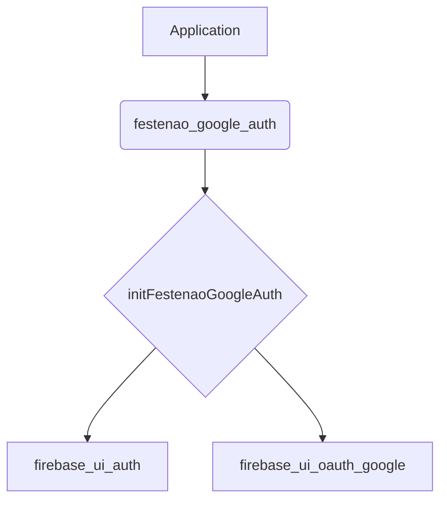

# Design: `festenao_google_auth`

## 1. Overview

`festenao_google_auth` will be a Flutter package that provides a simple, reusable configuration for Firebase Authentication using Firebase UI, specifically for email and Google providers. This package will abstract away the boilerplate code required to set up these authentication methods.

## 2. Goal

The primary goal of this package is to streamline the process of adding email and Google authentication to a Flutter application within the "festenao" project. It will provide a single function to initialize the necessary providers.

## 3. Alternatives Considered

### 3.1. No Abstraction

Each application could implement the Firebase UI configuration directly.

*   **Pros:** No extra package to maintain.
*   **Cons:** Code duplication across multiple apps, potential for inconsistencies, and harder to update the authentication configuration globally.

### 3.2. Configuration via `festenao_common`

The authentication configuration could be placed in the `festenao_common` package.

*   **Pros:** Centralized configuration.
*   **Cons:** `festenao_common` is a pure Dart package, and Firebase UI has Flutter dependencies. This would violate the separation of concerns.

## 4. Detailed Design

The package will expose a single public function:

```dart
/// Initializes the Firebase UI authentication providers for email and Google.
///
/// This function should be called once at the application startup.
///
/// It configures [FirebaseUIAuth] with an [EmailAuthProvider] and a
/// [GoogleProvider] with the specified [clientId].
Future<void> initFestenaoGoogleAuth({required String clientId});
```

The package will depend on `firebase_ui_auth` and `firebase_ui_oauth_google`.

### 4.1. Mermaid Diagram



## 5. Summary

The `festenao_google_auth` package will provide a simple and reusable way to configure Firebase Authentication with email and Google providers for Flutter applications in the "festenao" project.

## 6. Research

-   Firebase UI for Flutter: [https://firebase.flutter.dev/docs/ui/auth/](https://firebase.flutter.dev/docs/ui/auth/)
-   Google Sign-in with Firebase: [https://firebase.flutter.dev/docs/ui/auth/integrations/google](https://firebase.flutter.dev/docs/ui/auth/integrations/google)
